# vk_mini_path_tracer

A relatively small, beginner-friendly path tracing tutorial.

:arrow_forward: **[Load the tutorial!](https://nvpro-samples.github.io/vk_mini_path_tracer/index.html)** :arrow_backward:

This tutorial is a beginner-friendly introduction to writing your own fast,
photorealistic path tracer in less than 300 lines of C++ code and 250 lines of
GLSL shader code using Vulkan. Here's an example of what you'll render at the
end of this tutorial!

Vulkan is a low-level API for programming GPUs – fast, highly parallel processors.
It works on a wide variety of platforms – everything from workstations, to
gaming consoles, to tablets and mobile phones, to edge devices.

Vulkan is usually known as a complex API, but I believe that when presented in
the right way, it's possible to make learning Vulkan accessible to people of all
skill levels, whether they're never programmed graphics before or whether
they're a seasoned rendering engineer. Perhaps surprisingly, one of the best
ways to introduce Vulkan may be with GPU path tracing, because the API involved
is relatively small.

We'll show how to write a small path tracer, using the NVVK helpers, included in
the nvpro-samples framework, to help with some Vulkan calls when needed.
For advanced readers, we'll also optionally talk about performance tips and some
of the implementation details inside the helpers and Vulkan itself.

The final program uses less than 300 lines of C++ and less than 250 lines of GLSL shader code, including comments. You can find it [here](https://github.com/nvpro-samples/vk_mini_path_tracer/blob/main/vk_mini_path_tracer).

Here are all the Vulkan functions, and NVVK functions and objects, that we'll use in the main tutorial:

| **Vulkan Functions**     |                          |                          |
| ------------------------ | ------------------------ | ------------------------ |
| vkAllocateCommandBuffers | vkBeginCommandBuffer     | vkCmdBindDescriptorSets  |
| vkCmdBindPipeline        | vkCmdDispatch            | vkCmdFillBuffer          |
| vkCmdPipelineBarrier     | vkCreateCommandPool      | vkCreateComputePipelines |
| vkDestroyCommandPool     | vkDestroyPipeline        | vkDestroyShaderModule    |
| vkFreeCommandBuffers     | vkGetBufferDeviceAddress | vkQueueSubmit            |
| vkQueueWaitIdle          | vkUpdateDescriptorSets   |                          |

| **NVVK Functions and Objects** |                         |                            |
| ------------------------------ | ----------------------- | -------------------------- |
| nvvk::AllocatorDedicated       | nvvk::BufferDedicated   | NVVK_CHECK                 |
| nvvk::Context                  | nvvk::ContextCreateInfo | nvvk::createShaderModule   |
| nvvk::DescriptorSetContainer   | nvvk::make              | nvvk::RayTracingBuilderKHR |

-------

## Chapters

| **Chapter**                                                  |                                                              |                                                              |                                                              |
| ------------------------------------------------------------ | ------------------------------------------------------------ | ------------------------------------------------------------ | ------------------------------------------------------------ |
|  [Hello, Vulkan!](https://nvpro-samples.github.io/vk_mini_path_tracer/index.html#hello,vulkan!) |  [Device Extensions and Vulkan Objects](https://nvpro-samples.github.io/vk_mini_path_tracer/index.html#deviceextensionsandvulkanobjects) |  [Memory and Commands](https://nvpro-samples.github.io/vk_mini_path_tracer/index.html#memory) |  [Writing an Image](https://nvpro-samples.github.io/vk_mini_path_tracer/index.html#writinganimage) |
| 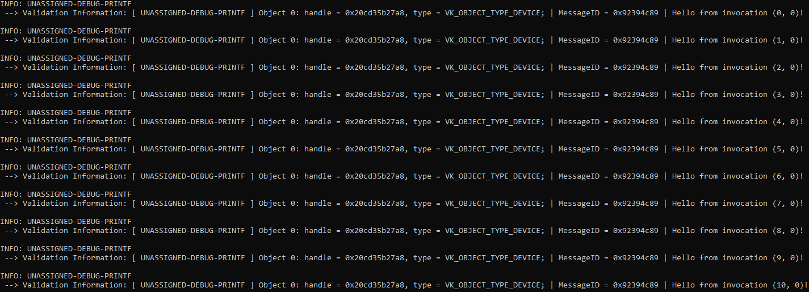 [Compute Shaders](https://nvpro-samples.github.io/vk_mini_path_tracer/index.html#computeshaders) | 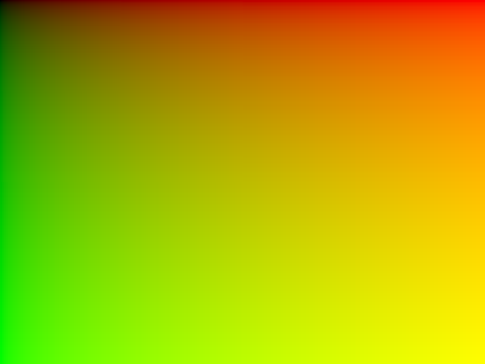 [Descriptors](https://nvpro-samples.github.io/vk_mini_path_tracer/index.html#descriptors) |  [Acceleration Structures and Ray Tracing](https://nvpro-samples.github.io/vk_mini_path_tracer/index.html#descriptors) | 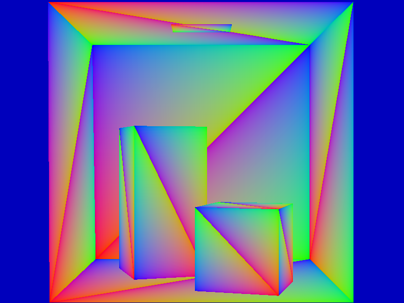 [Four Uses of Intersection Data](https://nvpro-samples.github.io/vk_mini_path_tracer/index.html#fourusesofintersectiondata) |
| 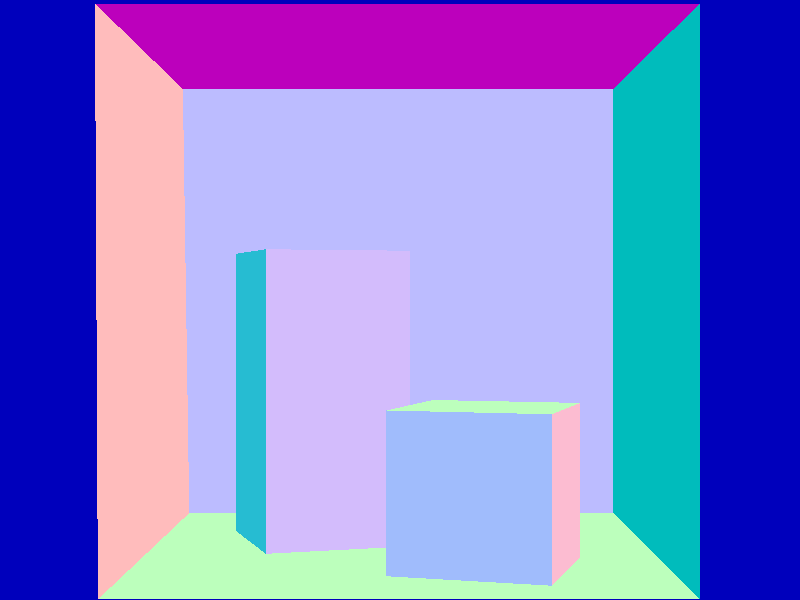 [Accessing Mesh Data](https://nvpro-samples.github.io/vk_mini_path_tracer/index.html#accessingmeshdata) | 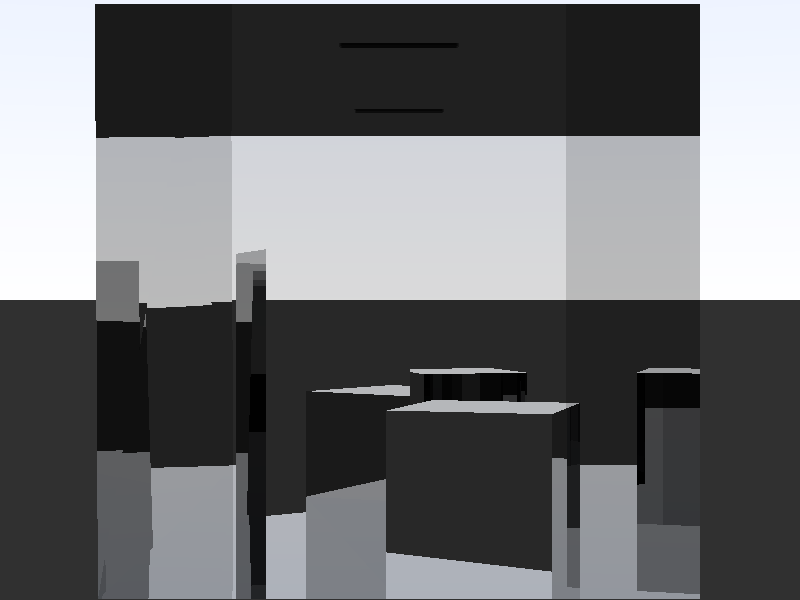 [Perfectly Specular Reflections](https://nvpro-samples.github.io/vk_mini_path_tracer/index.html#perfectlyspecularreflections) | 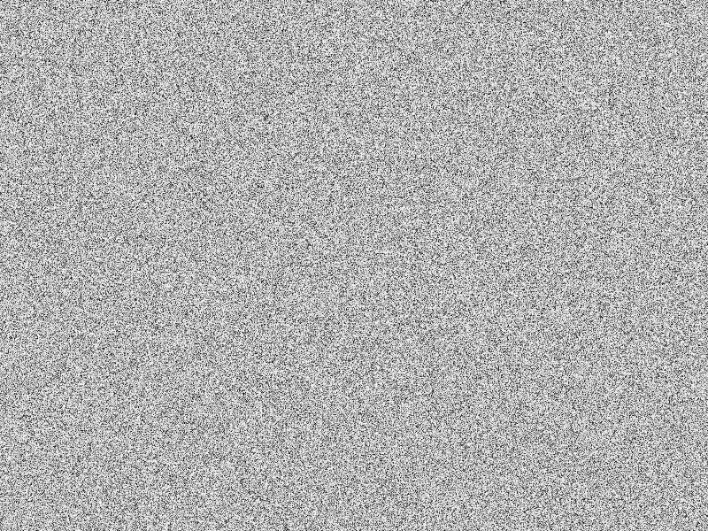 [Antialiasing and Pseudorandom Number Generation](https://nvpro-samples.github.io/vk_mini_path_tracer/index.html#antialiasingandpseudorandomnumbergeneration) |  [Diffuse Reflection](https://nvpro-samples.github.io/vk_mini_path_tracer/index.html#diffusereflection) |

## Extra Chapters

These are optional, extra tutorials that show how to polish and add new features to the main tutorial's path tracer. Make sure to check out the [list of further Vulkan and ray tracing resources](https://nvpro-samples.github.io/vk_mini_path_tracer/index.html#pnext:goingfurther/furtherreading) at the end of the main tutorial as well!

| **Extra Chapter**                                            |                                                              |                                                              |                                                              |
| ------------------------------------------------------------ | ------------------------------------------------------------ | ------------------------------------------------------------ | ------------------------------------------------------------ |
|   [Gaussian Filter Antialiasing](https://nvpro-samples.github.io/vk_mini_path_tracer/extras.html#gaussianfilterantialiasing) | 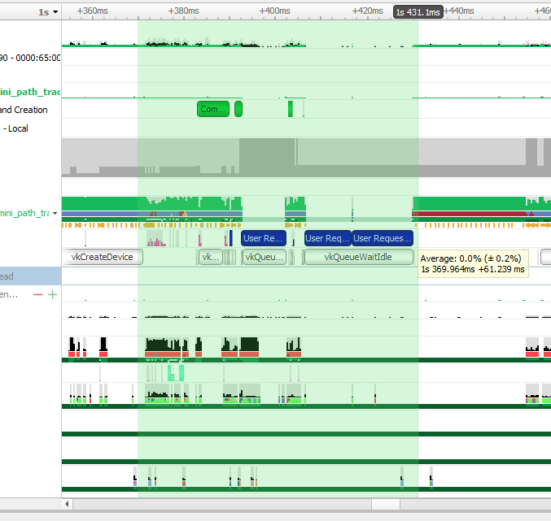 [Measuring Performance](https://nvpro-samples.github.io/vk_mini_path_tracer/extras.html#measuringperformance) |  [Compaction](https://nvpro-samples.github.io/vk_mini_path_tracer/extras.html#compaction) |  [Including Files and Matching Values Between C++ And GLSL](https://nvpro-samples.github.io/vk_mini_path_tracer/extras.html#includingfilesandmatchingvaluesbetweenc++andglsl) |
| 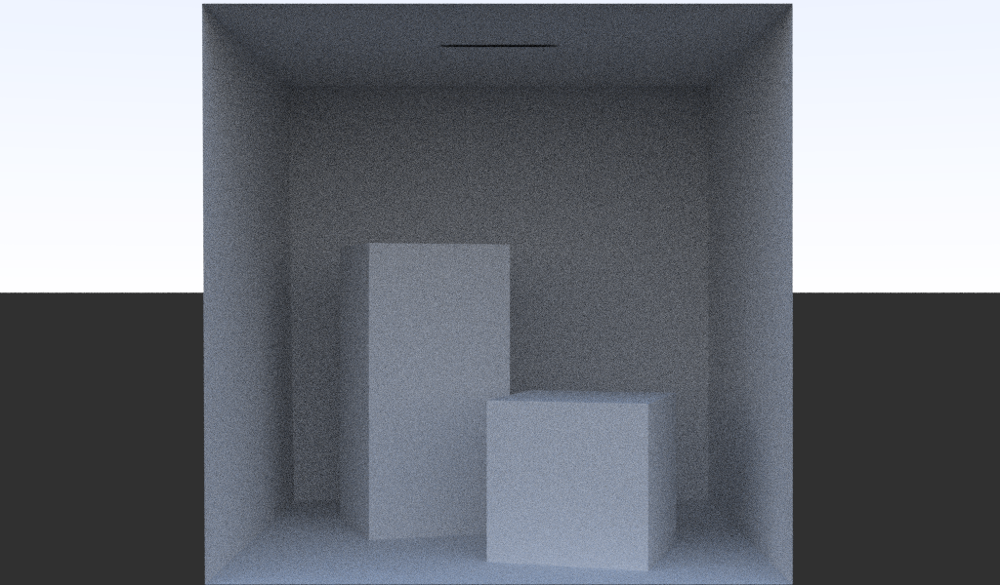  [Push Constants](https://nvpro-samples.github.io/vk_mini_path_tracer/extras.html#pushconstants) |  [More Samples](https://nvpro-samples.github.io/vk_mini_path_tracer/extras.html#moresamples) | 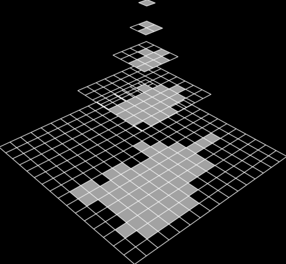 [Images](https://nvpro-samples.github.io/vk_mini_path_tracer/extras.html#images) |  [Debug Names](https://nvpro-samples.github.io/vk_mini_path_tracer/extras.html#debugnames) |
| 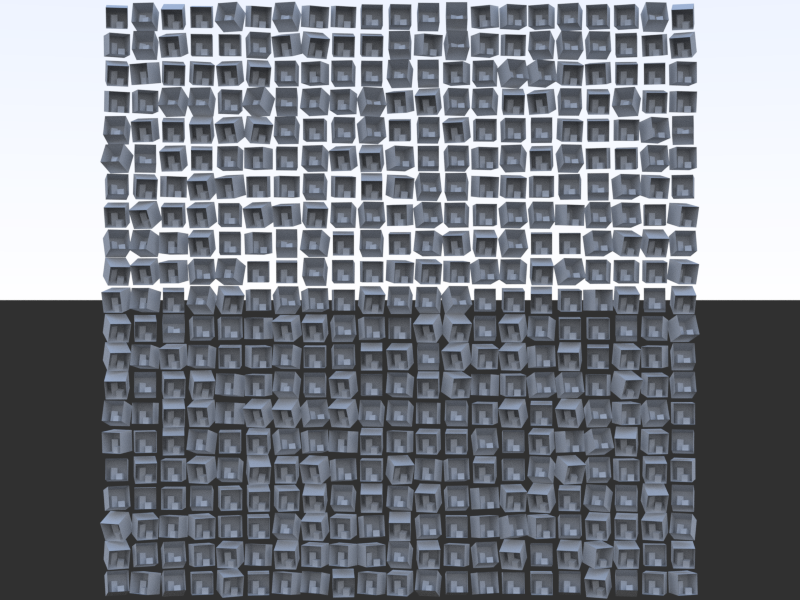 [Instances and Transformation Matrices](https://nvpro-samples.github.io/vk_mini_path_tracer/extras.html#instancesandtransformationmatrices) | 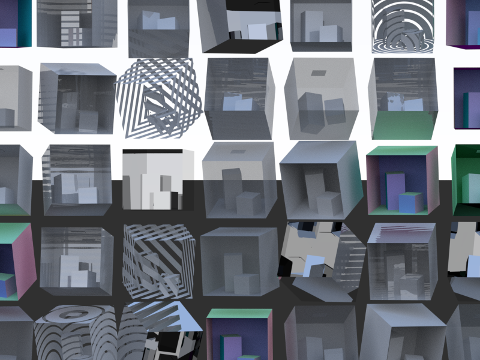 [Multiple Materials](https://nvpro-samples.github.io/vk_mini_path_tracer/extras.html#multiplematerials) | 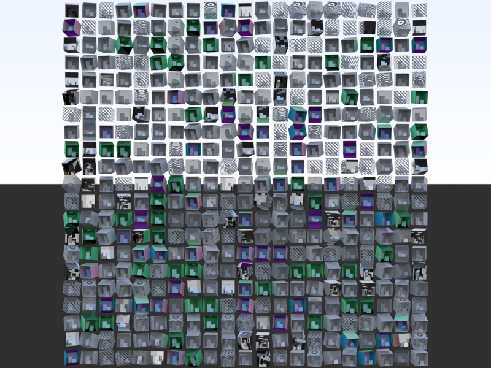 [Ray Tracing Pipelines](https://nvpro-samples.github.io/vk_mini_path_tracer/extras.html#raytracingpipelines) |                                                              |

## Building and Running

Please see the instructions [here](https://nvpro-samples.github.io/vk_mini_path_tracer/index.html#hello,vulkan!/settingupyourdevelopmentenvironment).

