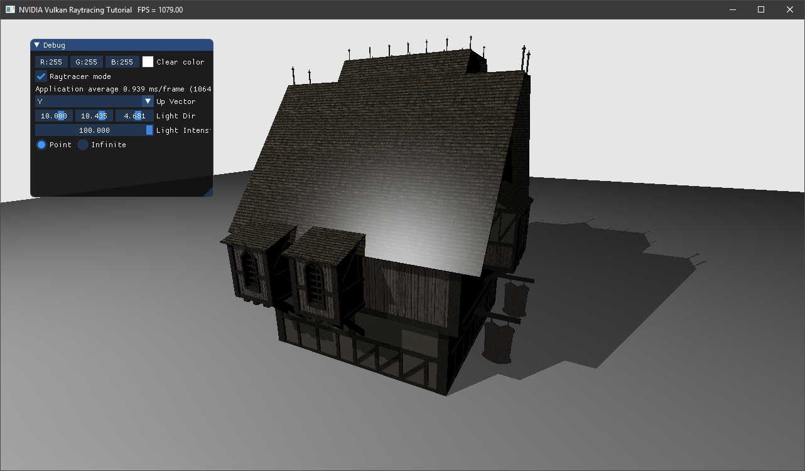



# NVIDIA Vulkan Ray Tracing Tutorials

******************************************************************************************
**Newer Tutorial version based on KHR**

There is a newer version of this tutorial, based on VK_KHR_ray_tracing extension.
* GitHub: https://github.com/nvpro-samples/vk_raytracing_tutorial_KHR
******************************************************************************************

The focus of this project and the provided code is to showcase a basic integration of
ray tracing within an existing Vulkan sample, using the
[`VK_NV_ray_tracing`](https://www.khronos.org/registry/vulkan/specs/1.1-extensions/html/vkspec.html#VK_NV_ray_tracing) extension.
The following tutorials starts from a the end of the previous ray tracing tutorial and provides step-by-step instructions to modify and add methods and functions.
The sections are organized by components, with subsections identifying the modified functions.

This project contains multiple tutorials all around Vulkan ray tracing.

Instead of having examples fully functional, those tutorial starts from a program and guide the user to add what is necessary.

## Ray Tracing Tutorial

The first tutorial is starting from a Vulkan code example, which can load multiple OBJ and render them using the rasterizer, and adds step-by-step what is require to do ray tracing.

### [**Start Ray Tracing Tutorial**](https://nvpro-samples.github.io/vk_raytracing_tutorial/)

# Going Further

From this point on, you can continue creating your own ray types and shaders, and experiment with more advanced ray tracing based algorithms.

### [**All Extra Tutorials**](https://nvpro-samples.github.io/vk_raytracing_tutorial/vkrt_tuto_further.md.html)
